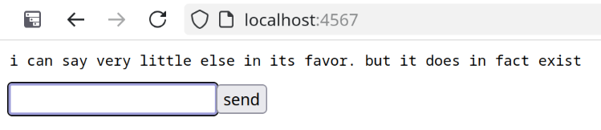

# minimum viable chat

all my friends seem to be building chat apps as their pet projects these days. i
find they usually do so because existing solutions are lacking in one or more
ways; their projects often aim to improve the chat experience in areas such as:

- interface customization
- identity management
- security/encryption capabilities
- (de)centralization of identity and/or messages

minimum viable chat does none of this. it doesn't give a fuck what you want, and
you're probably going to find it charming enough to fuck with it for a while
anyway. this is due to the core advantage it has over its competitors:

- it actually exists

[you can use minimum viable chat right now.](https://minimumviable.chat)[^1] or
you can run your own instance somewhere else and give it to your friends and use
it that way. or you can just laugh at this shitpost of a project and move on,
that's fine too. but you can't deny that it it exists now.

[^1]: at least, for now. this domain was on sale for the first year and i might
let it expire instead of paying full price for it next year. and also you guys
are probably freaks who are going to fill up my vps's disk with garbage
immediately. im a shitty queer web developer not a content moderator or sysadmin
or particularly interested in doing what you want me to do. but if neither of
those things has happened yet you can probably use the app.

## usage

    node shit.mjs

listens on port 80 by default; override with the `PORT` environment variable.

## license

i will assign this code's copyright to the next person who donates ten dollars
to my ko-fi. i am writing this document while bored in the las vegas airport on
a five hour layover and all the food here is so fucking expensive oh my god dude
i just wanted a slice of pizza.
